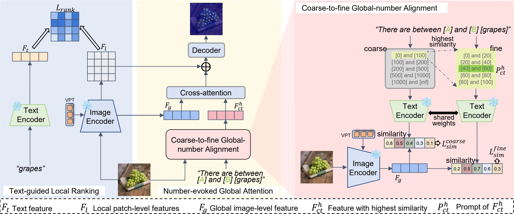

# LGCount: Enhancing Zero-shot Object Counting via Text-guided Local Ranking and Number-evoked Global Attention
[ICCV2025] Official Repository for "Enhancing Zero-shot Object Counting via Text-guided Local Ranking and Number-evoked Global Attention"


<div align="center" class="is-size-5 publication-authors">
  <span class="author-block"><a href="https://swzhang5.github.io/">Shiwei Zhang</a><sup>1,†</sup>,</span>
  <span class="author-block"><a href="https://github.com/zaqai">Qi Zhou</a><sup>1,†</sup>,</span>
<span class="author-block"><a href="https://gr.xjtu.edu.cn/web/wei.ke">Wei Ke</a><sup>1,2,*</sup></span>
</div>

<h3 align="center">ICCV 2025</h3>

<div align="center" class="is-size-5 publication-authors">
  <span class="author-block"><sup>1</sup>School of Software Engineering, Xi’an Jiaotong University, China,&nbsp;&nbsp;</span>
  <span class="author-block"><sup>2</sup>Pengcheng Laboratory, Shenzhen, China</span>
</div>

## [Paper (thecvf)](https://openaccess.thecvf.com/content/ICCV2025/papers/Zhang_Enhancing_Zero-shot_Object_Counting_via_Text-guided_Local_Ranking_and_Number-evoked_ICCV_2025_paper.pdf)



## Preparation

**Environment:** Create a virtural environment use Anaconda, and install all dependencies. We use an RTX 3090​ GPU with CUDA 11.8​ to train the model. 
```
conda create -n lgcount python=3.8 -y
conda activate lgcount
conda install pytorch==1.10.0 torchvision==0.11.0 torchaudio==0.10.0 cudatoolkit=11.3 -c pytorch -c conda-forge
pip install -r requirements.txt
pip install ftfy regex tqdm
pip install git+https://github.com/openai/CLIP.git
```

**Dataset:** 
[FSC-147](https://github.com/cvlab-stonybrook/LearningToCountEverything) | [ZSC-8K(google drive)](https://drive.google.com/file/d/1CW2ijGq1VgaP72zhVjx6lmU1j_yvydD_/view) | [ZSC-8K(123盘)](https://www.123865.com/s/j9YRVv-sJa7d) | [CARPK](https://lafi.github.io/LPN/) | [ShanghaiTech](https://www.kaggle.com/datasets/tthien/shanghaitech)

Extract and put the downloaded data in the `data/` dir. The complete file structure should look like this.
```
data
├─FSC/    
│  ├─gt_density_map_adaptive_384_VarV2/
│  ├─images_384_VarV2/
│  ├─FSC_147/
│  │  ├─ImageClasses_FSC147.txt
│  │  ├─Train_Test_Val_FSC_147.json
│  │  ├─ annotation_FSC147_384.json

```
> ​If​ you want to use the ZSC-8K dataset, please run `util/generate_npy.py` to generate the ground-truth density files.

## Run the Code

Please download the pretrained global-number alignment model and place it in the `ckpt` folder.

[google drive](https://drive.google.com/file/d/1JUn-O_do6zD4FuI45A-6ndWRRBI9sbZR/view) | [123盘](https://www.123865.com/s/j9YRVv-4Ja7d)

📘 **Train**. you can train the model using the following command. For first time you run the code, the forzen CLIP weight would be downloaded. 
```
CUDA_VISIBLE_DEVICES=0 python run.py --mode train --exp_name exp --batch_size 32 --start_val_epoch 120
```
---
🧰 **Evaluation**. Test the performance of trained ckpt with following command. You can change the `--dataset_type` parameter to test on different datasets.
```
CUDA_VISIBLE_DEVICES=0 python run.py --mode test --exp_name exp --batch_size 32 --dataset_type FSC --ckpt path/to/model.ckpt
```
You will get an similar result.
|         | Val MAE | Val RMSE | Test MAE | Test RMSE |
| ------- | ------- | -------- | -------- | --------- |
| LGCount | 17.52   | 58.39    | 16.42    | 100.63    |

## Acknoledgement

This project is based on implementation from [CLIP-Count](https://github.com/songrise/CLIP-Count).
